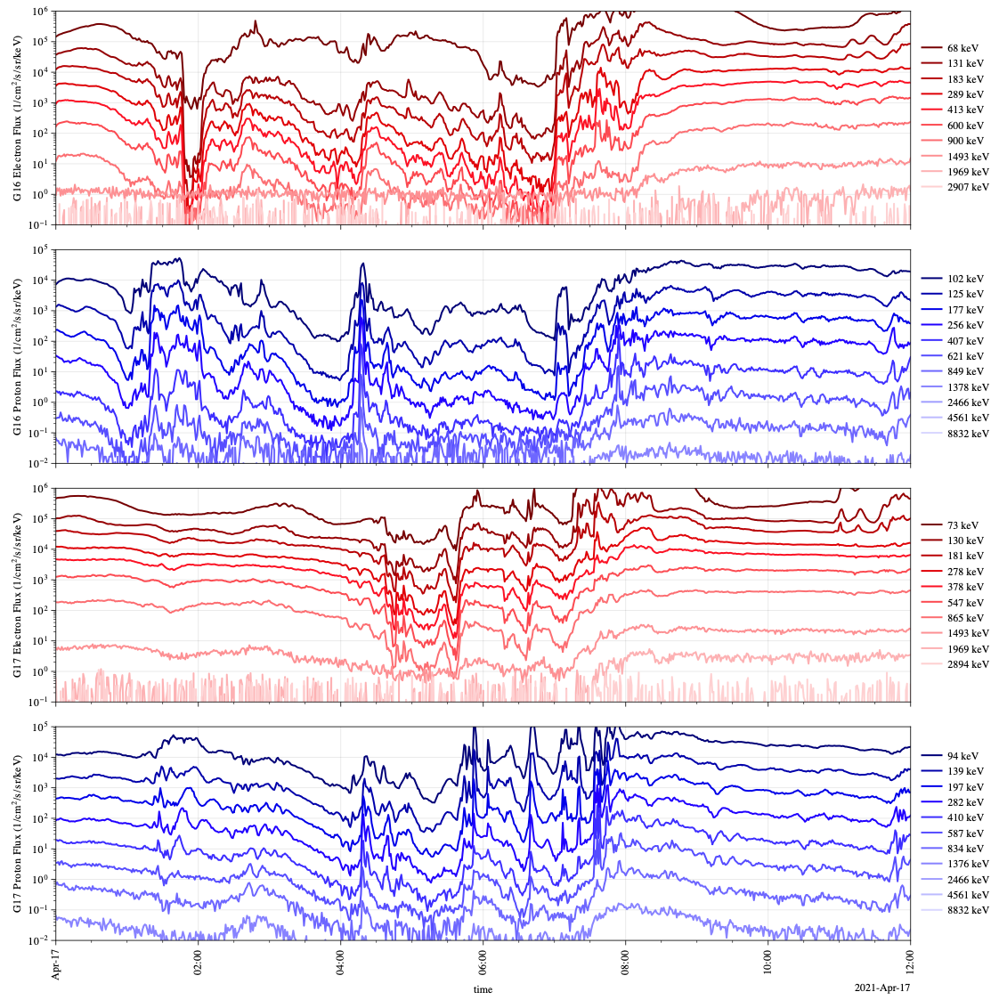
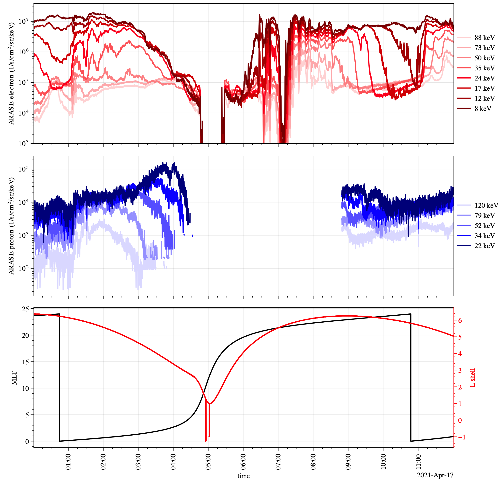
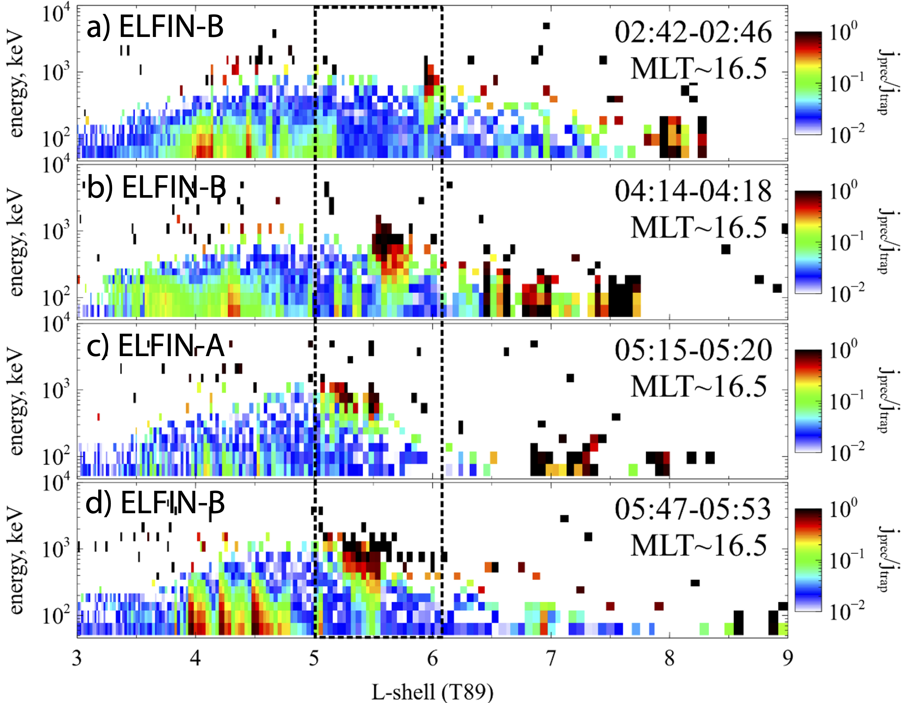
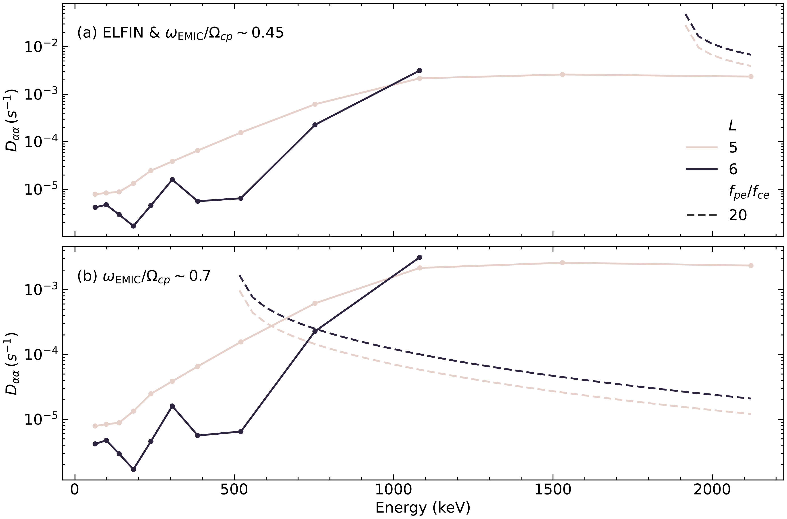
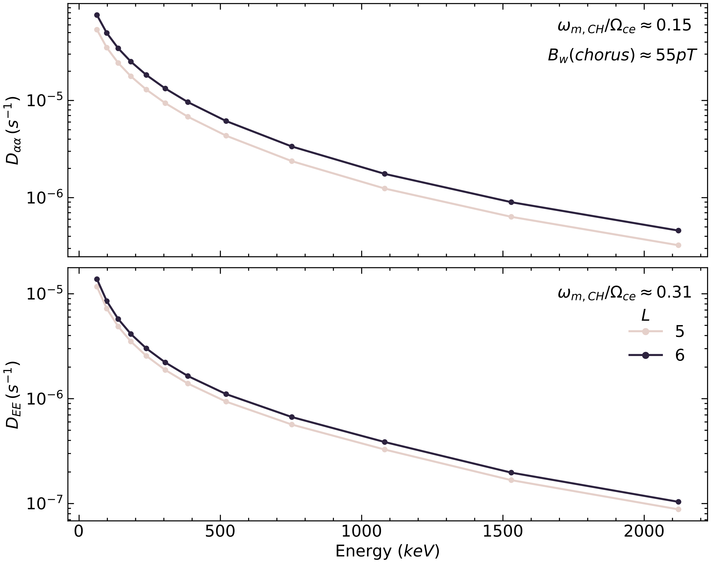
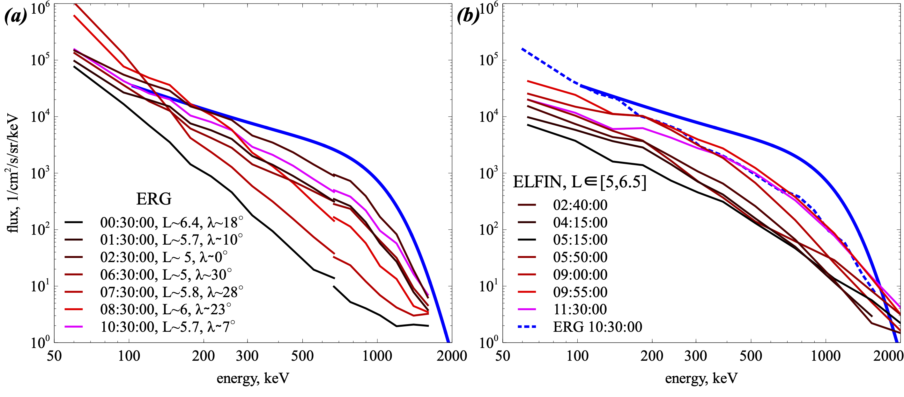

## Introduction & Motivation

Relativistic electron flux dynamics in the Earth's inner magnetosphere are largely controlled by electron scattering into the atmosphere via resonant interactions with whistler-mode and electromagnetic ion cyclotron (EMIC) waves.

ELFIN and POES spacecrafts recording trapped and precipitating particle fluxes at low altitude, together GOES, Van Allen Probes, ERG (ARASE) and MMS spacecrafts measuring waves and trapped particle fluxes at high altitude, provide a unique opportunity to study the dynamics of relativistic electron fluxes and their relation to wave activity.

## Method

Analysis of particle and wave data from multiple missions.

{width="60%"}

## Observations

{width="48%"}
{width="48%"}

{width="60%"}

{width="48%"}
{width="48%"}

{width="60%"}

- At $\sim$ 01:15 UT ERG observed strong electron injections likely supporting whistler-mode wave generation
- At 01:30-02:30 UT GOES16\&17 observed strong ion injections that arrived at ELFIN's MLT driving EMIC wave generation
- At 02:40-06:00 UT ELFIN observed continuous precipitation of relativistic electrons at MLT$\sim 16$; NOAA/POES observations suggest precipitations are located right at the inner edge of the ion plasma sheet; whistler-mode waves recorded by ERG (at MLT $\sim 20$) continuously scatter relativistic electrons from higher equatorial pitch-angles into the pitch-angle range resonating with EMIC waves
- At 07:10-07:30 UT ERG and GOES16\&17 observed a strong electron injection: dispersionless on ERG (MLT $\sim 20$) and dispersive on GOES 17 (MLT $\sim4$); This injection appears to restore electron fluxes and to largely compensate losses from EMIC wave-driven scattering